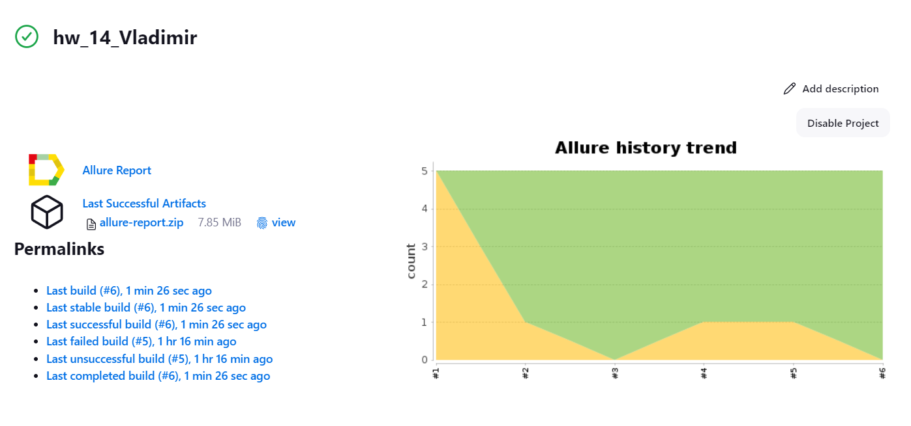
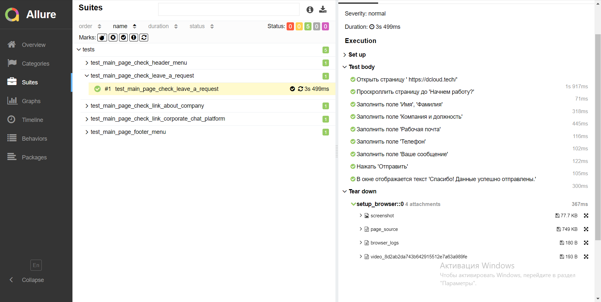
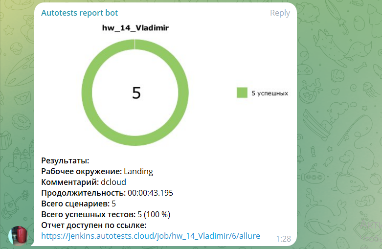

<h1 align="center">Проект <a href="https://dcloud.tech/">автоматизации лэнддинга dcloud</a> </h1>
<h2 align="center">Привет, меня зовут Владимир</h2>
<h3 align="center">QA-инженер</h3>
<h4 align="center">Занимаюсь ручным, автоматизированным и нагрузочным тестированием.</h4>

### Описание:
Было разработано несколько тест-кейсов:
-  Проверка текста ссылок меню хэдера
-  Проверка текста ссылок меню футера  
-  Проверка ссылки "О компании" 
-  Проверка перехода на проект "Корпоративная чат платформа "
-  Проверка заполнения формы "Оставить заявку"

Тесты реализованы с использованием PageObject

## Используемый стек технологий и инструментов

|                        Python                         |                        Pytest                         |                          Selen                          |                        Selenoid                         |                        Git                         |                        Jenkins                         |                        Allure                         |                          
|:-----------------------------------------------------:|:-----------------------------------------------------:|:-------------------------------------------------------:|:-------------------------------------------------------:|:--------------------------------------------------:|:------------------------------------------------------:|:-----------------------------------------------------:|
|  |  |  |  |  |  |  |

## Запуск автотестов
### Запуск автотестов реализован на Jenkins:
```bash
python -m venv .venv
source .venv/bin/activate
pip install -r requirements.txt
pytest --browser_version=${BROWSER_VERSION}
```

### Тесты выполняются на удаленном браузере благодаря использованию Selenoid

### Добавлена генерация отчетов на allure


### После прохождения автотестов, создаются тестовые артефакты в виде логов, скриншотов, html-страницы и видео прохождения кейса


### Добавлено уведомление о прохождении автотестов в Telegrm
